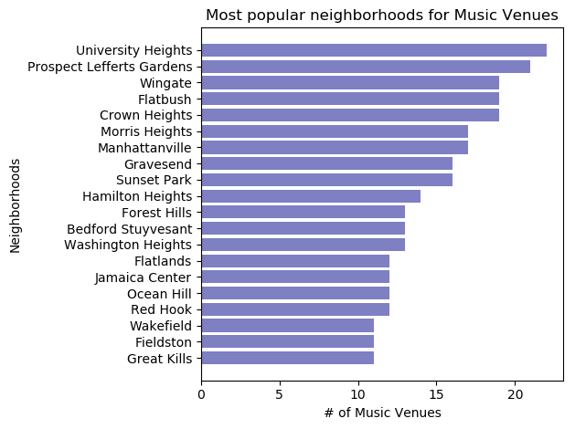

# Music-Related Venue Analysis: New York City

Team members: Nelson Leung, Faz Naimov, Greyson Ford

[Final Presentation](presentation.pdf)

## Key Questions

 1. What are the most popular neighborhoods for music venues in NYC?
2. What are the most popular venues by Category?
3. Which neighborhoods have the most highly rated/most liked venues? And is there a relationship between likes and ratings?

We wanted to understand which venues were popular, in general, and which were popular by neighborhood.

## Data Exploration and Extraction

#### NYU’s Spatial Data Repository

Our search was focused on the 5 boroughs of New York City. We used the 2014 New York City Neighborhood Names’ dataset hosted by NYU’s Spatial Data Repository as the basis for defining neighborhoods’ location (via location centroids) and name.

[NYU’s Spatial Data](https://geo.nyu.edu/catalog/nyu-2451-34572)

We downloaded the ‘2014 New York City Neighborhood Names’ dataset hosted by NYU’s Spatial Data Repository as a JSON file and imported into a Jupyter Notebook as a Pandas DataFrame. Then we used a loop to categorize the data into specific neighborhoods that returned neighborhood, latitude, and longitude. This serves as the foundation of the analysis.

``` python
column_names = ['Borough','Neighborhood', 'Latitude', 'Longitude']
neighborhoods = pd.DataFrame(columns=column_names)

for data in nycdata:
    borough = nycdata = data['properties']['borough']
    neighborhood_name = data['properties']['name']
    
    neighborhoodlatlon = data['geometry']['coordinates']
    lat = neighborhoodlatlon[1]
    lng = neighborhoodlatlon[0]
    
    neighborhoods = neighborhoods.append({'Borough':borough,
                                          'Neighborhood':neighborhood_name,
                                          'Latitude': lat,
                                          'Longitude': lng}, ignore_index=True) 
```

#### Foursquare — ‘Places API’

We used Foursquare’s ‘Places API’ to acquire data related to music-related ‘venues’ (as defined by Foursquare). Each Foursquare ‘venue’ is assigned a ‘category’ and each ‘category’ is associated with a particular ‘categoryID.’ A preliminary dataset of music-related venues associated with each NYC neighborhood was created by recursively sending “get” requests to the ‘api.foursquare.com/v2/venues/search?’ endpoint, making sure the results are specific to venues with music-related “Category IDs.”

``` python
def getNearby(neighborhoods, latitudes, longitudes, radius=1000):
    endpoint = endpoint = 'https://api.foursquare.com/v2/venues/search?'
    venues_list = []
    
    for hood_name, lat, lng, in zip(neighborhoods, latitudes, longitudes):
        url = create_url(endpoint, CLIENT_ID, CLIENT_SECRET, VERSION, lat, lng, radius, categoryId)
        
        results = requests.get(url).json()['response']['venues']
        
        for item in results:
            venue_name = item['name']
            venue_id = item['id']
            venue_category = item['categories'][0]['name']
            venue_lat = item['location']['lat']
            venue_lng = item['location']['lng']
            category_id = item['categories'][0]['id']
            try:
                venue_city = item['location']['city']
            except:
                venue_city = 'N/A'
            venue_state = item['location']['state']
            
            venues_list.append([(hood_name,
                                lat,
                                lng,
                                venue_name,
                                venue_id,
                                category_id,
                                venue_category,
                                venue_lat,
                                venue_lng,
                                venue_city,
                                venue_state
                                )])
    nearby_venues = pd.DataFrame([item for venue_list in venues_list for item in venue_list])
    nearby_venues.columns = ['Neighborhood',
                             'Neighborhood Latitude',
                             'Neighborhood Longitude',
                             'Venue Name',
                             'Venue ID',
                             'Category ID',
                             'Venue Category',
                             'Venue Latitude',
                             'Venue Longitude', 
                             'Venue City', 
                             'Venue State'
                            ]
    return nearby_venues

prelim_venue_data = getNearby(neighborhoods['Neighborhood'],
                              neighborhoods['Latitude'],
                              neighborhoods['Longitude'])
```

[Data Exploration and Extraction Jupyter Notebook](Foursquare%20API.ipynb)

## Data Cleansing

First, venues located in states other than “New York” or “NY” were removed. Entries with “Venue State” equal to “New York” were changed to “NY.”

``` python
ny_venue_data = prelim_venue_data[(prelim_venue_data['Venue State']=='New York') | (prelim_venue_data['Venue State']=='NY')]
ny_venue_data['Venue State'].replace(to_replace='New York', value = 'NY', inplace=True)
```

#### Duplicate Venues & N/A

Some venues are assigned to multiple neighborhoods because the venue is within 1,000 meters of the neighborhood’s centroid location.
We chose an inclusive model which counts these venues in each neighborhood in order to properly size each neighborhood’s music profile without excluding any businesses that contribute to the identity of the area. Entries returned by Foursquare with no ‘Venue City’ and given the ‘N/A’ treatment were also removed

``` python
ny_venue_data_with_city = ny_venue_data[(ny_venue_data['Venue City'] != "N/A")]
```

#### Removing Venues with that were not music venues

Although specific category IDs were used in our API calls, the data showed a significant amount of venues that did not fall within our categories. We utilized a filter to keep only venues that we were interested in.

``` python
music_related_categories = ['Music Venue', 'Lounge', 'Nightclub', 'Jazz Club', 'Recording Studio', 'Piano Bar', 'Record Shop', 'Concert Hall', 'Kareoke Bar', 'Rock Club', 'Amphitheater', 'Music Festival', 'Opera House', 'Music School']
ny_music_venues = ny_venue_data_with_city[ny_venue_data_with_city['Venue Category'].isin(music_related_categories)]
```

[Data Cleansing Jupyter Notebook](Data%20Cleansing.ipynb)

## Data Enrichment

#### Music-related Venues: Adding Likes and Ratings

After cleaning our initial data we enriched it with additional user inputs with a second API call to a different Foursquare endpoint.

We wrote a function that accepted index values when called to work within the premium API call limit of 500 per day. By designing the function in this manner, each team member was able to utilize their respective API keys to retrieve a specific set of venues to complete our data set.
``` python
def venue_info(df, start_index, end_index, v=20180405):
    responses = []
    print("Beginning Data Retrieval")
    print("-------------------------------")
    
    #start_index = 0 # index from which we begin polling venue information due to rate limited
    #end_index = 0 # index at which we stop polling, or earlier if failure returned from 4sq

    for index in range(start_index, end_index):
        id = df.loc[index,"Venue ID"]
        print ('Attempting to get information for venue with id = ', id)
        
        url = f"https://api.foursquare.com/v2/venues/{id}?&v={v}&client_id={CLIENT_ID}&client_secret={CLIENT_SECRET}"
        
        response = requests.get(url)
        
        if response.status_code != 200:
            print ('Failure response from Foursquare API, breaking...')
            break
        else:
            result = response.json()['response']
            responses.append(result)
            try:
                df.loc[index,"Likes"]=result['venue']['likes']['count']
            except:
                df.loc[index,"Likes"]=0
            try:
                df.loc[index,"Rating"]=result['venue']['rating']
            except:
                df.loc[index,"Rating"]="N/A"

    print("Data Retrieval Complete")

venue_info(df, 1000, 1227,v=20180405)
```

[Data Enrichment Jupyter Notebook](LikesnRatings.ipynb)


##	Our Findings

-   The most popular neighborhood for music-related venues was University Heights with 23 venues in the same neighborhood.

    
    
    
-   While there were few Manhattan neighborhoods represented in the top 20 neighborhoods, they dominated in terms of popularity, or total number of likes.

    
    
    
-   Lounges, Music Venues, and Nightclubs were the top 3 venue categories among the most liked venues.

    
    
- Positive correlation between likes and rating once the rating goes beyond 7 that you can see on the scatter plot below. Also 8 out of top 10 neighborhoods with average likes are located in Manhattan as well as 7 out of the 10 locations for highest average rating.


[Visualizations Jupyter Notebook](Visualizations.ipynb)
